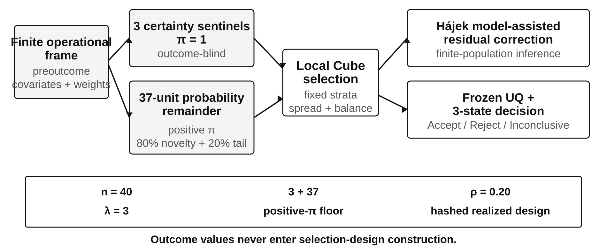
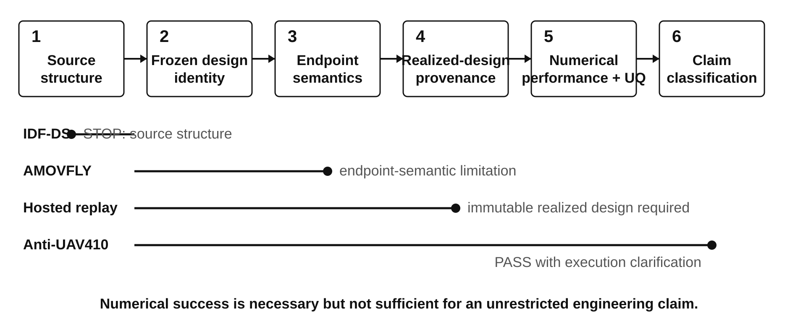

# Probability-Preserving Active Test Allocation Under Severe Live-Test Budgets: c-pKTES-Hedge with Layered External Validation

**Research manuscript v8.3 — IEEE journal-format gate Markdown draft**  
**Frozen evidence source:** `PAPER_IEEE_v8_2.md` / frozen v8 evidence  
**Revision rule:** journal-format and readability only; no method retuning, new experiment, endpoint redefinition, or evidence-class change.

---

**Abstract**—Operational test and evaluation under severe live-test budgets must support population inference while still exposing difficult operating conditions. We study **c-pKTES-Hedge**, a probability-preserving 40-test design that combines three outcome-blind certainty sentinels with a 37-unit positive-inclusion-probability remainder. The remainder is tilted toward kernel novelty and a frozen adverse-tail score, spread with Local Cube sampling, and analysed using stratum-wise Hájek model-assisted residual correction and frozen uncertainty diagnostics. In an independent confirmation over 1000 finite populations, edge hit is 81.2% versus 77.9% for a 15-deterministic-plus-audit comparator; the paired interval crosses zero, so no edge-superiority claim is made. Profile, failure, and critical-tail mean absolute errors decrease from 0.008348, 0.060399, and 0.020958 to 0.006824, 0.051746, and 0.016811, respectively, while definitive-correct decisions rise from 8.9% to 17.3%. External validation is fail-closed. Anti-UAV410 passes all numerical guardrails but retains a profile-error disadvantage and is classified **PASS_WITH_EXECUTION_CLARIFICATION**. IDF-DS is stopped before outcome opening because the public source cannot instantiate the preregistered preoutcome frame. AMOVFLY passes the frozen numerical comparison, but systematic `(0,0)` waypoint placeholders contaminate the literal endpoint; its classification is **NUMERICAL CONFIRMATORY PASS WITH ENDPOINT-SEMANTIC LIMITATION**. The evidence supports probability-preserving active enrichment as a small-budget allocation principle while showing that external validity depends jointly on source structure, endpoint semantics, and realized-design provenance.

**Index Terms**—balanced sampling, finite-population inference, Hájek estimator, Local Cube, operational test and evaluation, probability sampling, small-sample qualification, test allocation, uncertainty quantification.

---

## I. Introduction

Operational test and evaluation (T&E) under a severe live-test budget faces two competing requirements [15]. Population-level decisions require a defensible probability-sampling basis, yet equal-probability designs can spend scarce trials in dense central regions and miss rare or compound adverse conditions. A common response is to reserve a deterministic block for difficult cases and use the remaining trials as an audit sample, but the deterministic block then contributes weakly to population inference.

This paper studies a probability-preserving alternative. At the frozen primary budget of 40 live tests, **c-pKTES-Hedge** assigns first-order inclusion probability one to three outcome-blind certainty sentinels and selects the other 37 units with known positive first-order inclusion probabilities. The remainder is actively tilted toward kernel novelty and compound adverse conditions while retaining a probability floor; Local Cube sampling spreads the selected units in auxiliary-feature space. A stratum-wise Hájek model-assisted residual correction then uses the known live-test inclusion probabilities for finite-population inference. Simulation or surrogate predictions enter only as wall-to-wall auxiliary information and are never converted into live effective sample size.

The paper makes four contributions. First, it combines outcome-blind certainty units and a positive-inclusion-probability remainder in one design rather than treating active discovery and audit sampling as disconnected campaigns. Second, it freezes a small-N architecture coupling novelty, a mild adverse-tail hedge, Local Cube spreading, Hájek residual correction, frozen uncertainty diagnostics, and three-state Accept/Reject/Inconclusive decisions. Third, it separates R1–R5 development from a 1000-population independent confirmation and does not retune the final method on external data. Fourth, it treats external validation as a sequence of source, design, endpoint, provenance, and numerical gates rather than a single performance score.

The resulting claim is deliberately narrow. We do not argue that 40 tests replace a large campaign or that the method is universally optimal. We ask whether a probability-preserving active design can improve the inference–edge-discovery trade-off at severe budget and whether that design logic survives independent data without outcome-driven redesign.

---

## II. Related Work

Scenario-based validation, accelerated evaluation, and importance-sampling approaches allocate testing effort toward rare or safety-relevant events when exhaustive physical testing is infeasible [6]–[8]. Kernel-based distribution matching and sample-selection-bias correction provide related mechanisms for representing a target population under nonuniform sampling [9], [10]. The present problem differs in that the scarce resource is the **live-test count** and the final campaign must retain a probability-design interpretation.

Unequal-probability, balanced, and spatially balanced sampling provide the statistical basis for that objective. The cube method targets auxiliary balance under prescribed first-order inclusion probabilities [1], while local pivotal methods discourage simultaneous selection of nearby units [2]. c-pKTES-Hedge uses these tools as components; the contribution is their T&E-specific composition with outcome-blind certainty sentinels, active but positive-probability remainder sampling, and fail-closed external-validation governance.

Model-assisted survey estimation provides the inferential analogue. A wall-to-wall predictor can reduce residual variance while the probability sample preserves correction for prediction error [4]. We use a Hájek-form residual correction for stability under unequal small-sample weights, while keeping inclusion probabilities explicit [3]–[5]. The paper does not claim exact finite-sample unbiasedness of the ratio correction or distribution-free safety calibration. Small-sample reliability demonstration likewise highlights the tension between decision power and false-accept control [16], [17], motivating the explicit Inconclusive state used here.

---

## III. Problem Formulation

Let

\[
U=\{1,\ldots,N\}
\]

be a finite population of candidate test conditions with operational weights

\[
p_i\ge 0,\qquad \sum_{i\in U}p_i=1.
\]

The population is partitioned into an operational core and mandatory critical domains. Let `Y_i` denote a bounded performance outcome and `B_i` an adverse indicator where such an endpoint is semantically valid. Representative estimands are

\[
\theta_Y=\sum_i p_iY_i,
\qquad
\theta_B=\sum_i p_iB_i,
\]

with analogous critical-domain means.

The live-test budget is

\[
n_L=40.
\]

The design must simultaneously retain a probability basis for population inference, enrich rare or compound adverse conditions, and avoid unstable inverse-probability weights. In confirmatory external studies, novelty, risk, strata, inclusion probabilities, and certainty sentinels may use only information available before opening the live outcomes.

---

## IV. c-pKTES-Hedge

The final live-test design contains three outcome-blind certainty sentinels and a 37-unit probability remainder. The certainty units have `pi=1`; non-certainty inferential units retain positive first-order inclusion probabilities, except where the frozen capped-inclusion algorithm naturally caps a probability-remainder unit at one. The sentinel portfolio contains one pure-novelty guard and two risk-aware sentinels, with sequential diversification to avoid local collapse.

For a non-certainty unit `i`, let `N_i` denote kernel novelty and `C_i` a compound adverse-tail score computed only from preoutcome covariates. The frozen score is

\[
z_i=0.80N_i+0.20C_i,
\]

with first-order probabilities tilted within stratum by

\[
\pi_i\propto \exp\{3(z_i-\bar z_g)\},
\]

subject to the frozen probability floor and exact stratum allocation. Thus `rho=0.20` and `lambda=3` are fixed before independent confirmation.

Given the prescribed first-order probabilities, Local Cube sampling provides spreading and approximate auxiliary balance. Let `m_i` be a wall-to-wall auxiliary prediction. Within stratum `g`, the model-assisted residual correction is

\[
\widehat R_{g,H}
=
\frac{\sum_{i\in s_g}(p_{i\mid g}/\pi_i)(Y_i-m_i)}
{\sum_{i\in s_g}p_{i\mid g}/\pi_i},
\]

and the overall estimator is

\[
\widehat\theta_Y
=
\sum_g P(G_g)
\left[
E_{p_g}\{m(X)\}+\widehat R_{g,H}
\right].
\]

For selected probability-remainder units, weight stability is summarized with Kish effective sample size. Uncertainty uses the frozen `max(GS,PWR)` diagnostic and R3 calibration. The legal decisions are Accept, Reject, and Inconclusive; the objective is controlled evidence rather than maximum definitive-decision rate. **Figure 1 and Table I summarize the frozen design contract.**

**TABLE I. Frozen c-pKTES-Hedge contract.**

| Component | Frozen specification |
|---|---|
| Budget / architecture | `n=40`: 3 outcome-blind certainty sentinels + 37 positive-`pi` remainder units |
| Active score | 80% kernel novelty + 20% compound adverse-tail; `rho=0.20`, `lambda=3`, frozen probability floor |
| Selection | Local Cube under fixed stratum allocation |
| Estimation | stratum-wise Hájek model-assisted residual correction |
| UQ / decision | `max(GS,PWR)`, frozen R3 calibration; Accept / Reject / Inconclusive |
| Reproducibility identity | source/runtime metadata + hashed realized design object |

**Fig. 1.** Frozen c-pKTES-Hedge architecture. Three outcome-blind certainty sentinels are embedded in a 40-test probability design whose remaining 37 units retain positive first-order inclusion probabilities. R1–R4 development history is retained in Supplementary Section S1.

---

## V. Evidence Protocol

The method was developed through R1–R5 and frozen before independent confirmation. R1 contrasted an all-probability design with a 15-deterministic-plus-audit split; R2 added novelty-driven unequal probabilities and local spreading; R3 added three risk-aware certainty sentinels; R4 hedged the certainty portfolio with one pure-novelty sentinel; R5 added a mild compound adverse-tail component to the probability remainder and froze `rho=0.20`. Full development details are in Supplementary Section S1.

The final R5 design was then evaluated on 1000 new finite populations, 200 each under `good`, `global_bias`, `tail_bias`, `hidden_bias`, and `mixed` discrepancy scenarios. The R3 safety calibration was developed and frozen before R5 confirmation. Confirmation evaluates profile, failure, critical-tail, edge-hit, definitive-correct, abstention, coverage diagnostics, and false acceptance.

Phase 2 freezes the method contract in Table I. An external source that cannot instantiate the promised preoutcome frame is stopped rather than rescued with outcome-derived covariates. If a post-outcome semantic defect is discovered, the executed result remains visible and the claim is narrowed; a repaired sensitivity cannot be promoted to a new confirmation.

Three external settings operationalize this contract. Anti-UAV410 uses the official 120-sequence test split and per-sequence State Accuracy with 40 selected sequences [11]. IDF-DS is audited for the flight-linked preoutcome design information required by the preregistered Phase 2B protocol before telemetry outcomes are opened [12], [13]. AMOVFLY uses a separately frozen 257-flight finite population across four scenario strata and a literal 10 m waypoint-attainment endpoint [14]. Full execution identities and detailed comparator tables are moved to Supplementary Sections S4–S10.

---

## VI. Results

### A. Independent controlled confirmation

**Figure 2 and Table II summarize the paired R5 confirmation.**

**Fig. 2.** R5 independent controlled confirmation over 1000 finite populations. Points show paired c-pKTES-Hedge-minus-Split15 differences with 95% confidence intervals. The edge-hit interval crosses zero; no edge-superiority claim is made.

**TABLE II. R5 independent confirmation, `n=40`.**

| Metric | c-pKTES-Hedge | Split15 | Paired difference | 95% CI |
|---|---:|---:|---:|---:|
| Edge hit | **0.812** | 0.779 | +0.033 | -0.0013 to +0.0673 |
| Profile MAE | **0.006824** | 0.008348 | -0.001525 | -0.002025 to -0.001024 |
| Failure MAE | **0.051746** | 0.060399 | -0.008653 | -0.012595 to -0.004711 |
| Critical-tail MAE | **0.016811** | 0.020958 | -0.004147 | -0.004798 to -0.003497 |
| Definitive correct | **0.173** | 0.089 | +0.084 | +0.0555 to +0.1125 |
| Abstain | 0.826 | 0.911 | -0.085 | -0.1135 to -0.0565 |

The edge-hit point estimate is higher for c-pKTES-Hedge, but its paired interval crosses zero. The evidence therefore supports no detected edge-discovery disadvantage at the reported precision, not statistically significant superiority. The stronger result is inferential: profile, failure, and critical-tail errors are lower, definitive-correct decisions increase, and abstention falls.

The hidden-bias subgroup remains an important boundary. Edge hit is 0.770 for c-pKTES-Hedge and 0.795 for Split15, with a paired difference of -2.5 percentage points and 95% CI -10.17 to +5.17 percentage points. Across 945 true-Reject populations, zero false accepts are observed; this is descriptive evidence under the frozen confirmation distribution, not proof of zero operational false-accept probability. The frozen R3 calibration raises failure marginal coverage from 94.9% to 99.0% and safety upper-bound coverage from 97.1% to 99.9%; detailed UQ results are in Supplementary Section S3.

### B. Layered external evidence

**Figure 3 and Table III summarize the external evidence classes without collapsing them into a single pass/fail label.**

**Fig. 3.** Layered external evidence. Anti-UAV410, IDF-DS, and AMOVFLY terminate at different evidence states because source admissibility, execution, numerical performance, and endpoint semantics are assessed separately.

**TABLE III. External evidence classification.**

| Dataset | Gate / numerical result | Limiting validity issue | Final evidence class |
|---|---|---|---|
| Anti-UAV410 | source pass; profile error `+0.00404` vs SRS, 95% CI `0.00137` to `0.00671`, inside frozen `+0.01` bound; critical-domain error lower | exact Split15 adapter and finite-domain estimator required execution clarification | `PASS_WITH_EXECUTION_CLARIFICATION` |
| IDF-DS | source **stop** before outcome opening; no method-performance result | preregistered flight-level preoutcome frame not recoverable from public release | `BLOCKED_SOURCE_STRUCTURE` |
| AMOVFLY | source pass; KTES-SRS profile-error difference `-0.0007586`, 95% CI `-0.0011638` to `-0.0003534`; all frozen numerical gates pass | exact `(0,0)` waypoint placeholders contaminate the literal endpoint | `NUMERICAL CONFIRMATORY PASS WITH ENDPOINT-SEMANTIC LIMITATION` |

Anti-UAV410 is not uniformly favourable. Stratified SRS has lower profile error, but the increase of 0.00404 remains within the frozen +0.01 non-inferiority guardrail; c-pKTES-Hedge has lower critical-domain error. All numerical guardrails pass under the disclosed adapter, but the exact numerical Split15 adapter and finite-domain critical-domain estimator were instantiated after `SA_i` recovery. The result is therefore retained as **PASS_WITH_EXECUTION_CLARIFICATION**, not a pristine preregistered pass. Full comparator and ESS results are in Supplementary Section S4.

IDF-DS produces no method-performance result. The public release cannot instantiate the preregistered flight-level outcome-blind design frame at the required resolution before telemetry opening. Using realized trajectories, speed, duration, wind histories, or other telemetry as rescue covariates would turn the external source into development data. The study therefore stops at **BLOCKED_SOURCE_STRUCTURE**. Structural audit details are in Supplementary Section S5.

AMOVFLY passes all frozen numerical comparison gates, including a favourable KTES-SRS profile-error difference and lower critical-domain error. A post-outcome semantic audit then finds that all 257 flights contain exact `(0,0)` aim-waypoint episodes and that every one of the 378 episodes with minimum actual-to-aim distance above 100 km is an exact-zero episode. The literal flight-level failure endpoint is therefore degenerate, and the bounded `Y10` endpoint is materially affected by placeholder semantics. The executed numerical result remains visible, but the final classification is **NUMERICAL CONFIRMATORY PASS WITH ENDPOINT-SEMANTIC LIMITATION**. Full comparator results, semantic-audit counts, and the diagnostic sensitivity are in Supplementary Sections S6–S8.

A later hosted-runner attempt to regenerate the AMOVFLY design from the same high-level source/runtime metadata and seeds failed the exact design-object identity check: 254 of 257 first-order inclusion probabilities differed by more than `1e-12`, with maximum absolute difference 0.0108412. No tolerance was relaxed. Downstream sensitivity analysis therefore consumes the immutable realized design object from the successful confirmatory run. Full diagnostics are in Supplementary Section S9.

---

## VII. Discussion

**Figure 4 synthesizes the claim-governance logic exposed by the three external studies and the realized-design replay audit.**

**Fig. 4.** Evidence validity is a gated chain rather than a single accuracy number. IDF-DS stops at the source gate; AMOVFLY is limited by endpoint semantics; the hosted-runner drift motivates immutable realized-design provenance; Anti-UAV410 reaches the final classification gate with an execution clarification.

### A. What the evidence supports

The controlled confirmation supports c-pKTES-Hedge as a **probability-preserving active test allocation**, not a universally optimal sampler. At `n=40`, edge discovery is statistically compatible with Split15 at the precision supported by the paired interval while profile, failure, and critical-tail inference improve and definitive-correct decisions increase. The mechanism is the preservation of known first-order probabilities for the 37-unit remainder, which allows active pressure toward difficult conditions without turning most of the live campaign into a nonprobability sample.

Two real-data settings support transport of the sampling/inference logic, but neither supplies a clean field-certification claim. Anti-UAV410 preserves an unfavourable dimension—higher profile error than SRS—while still passing the frozen non-inferiority bound and showing lower critical-domain error. AMOVFLY provides stronger numerical support but fails to supply an uncontaminated literal engineering endpoint. IDF-DS contributes a different form of evidence: a source can be scientifically ineligible before the algorithm is tested.

### B. External validity has separable gates

The external results show that source admissibility, endpoint semantics, and numerical performance cannot be collapsed into one validation label. IDF-DS demonstrates a **source-eligibility gate**: if the preoutcome frame cannot be constructed without realized telemetry, continuing would invalidate the confirmatory claim. AMOVFLY demonstrates an **endpoint-semantic gate**: a bounded metric can be numerically stable yet semantically compromised by systematic placeholders. Anti-UAV410 demonstrates an **execution gate**: a numerical pass can remain weaker than a pristine preregistration when comparator details require post-recovery clarification.

The AMOVFLY regeneration audit adds a provenance gate. For floating-point unequal-probability designs, source code, package versions, frame, and seeds may not fully identify the realized sampling design. If downstream estimators depend on `pi_i`, the exact realized inclusion-probability vector and deterministic identities should be written, hashed, and archived before outcomes are opened.

### C. Limitations

The R5 confirmation remains simulation-based despite 1000 independent finite populations and multiple discrepancy regimes. The edge-hit difference versus Split15 is not statistically significant. Anti-UAV410 is a task-effectiveness benchmark rather than operational weapon-system T&E and carries an execution clarification. IDF-DS never reaches a performance comparison. AMOVFLY's literal failure endpoint is invalid for failure-rate qualification, and its post-outcome sensitivity cannot be promoted to a repaired confirmation. The model-assisted estimator still depends on the external availability and quality of auxiliary predictions when they are used. Finally, the frozen R3 uncertainty calibration is empirically audited within the development/confirmation architecture rather than established as distribution-free under arbitrary domain shift.

### D. Next independent gate

The next study should use a new independently frozen engineering dataset and endpoint contract rather than retuning Anti-UAV410 or AMOVFLY. It should provide unit-linked preoutcome mission/configuration/environment covariates before outcome access, independently verified endpoint semantics, a written and hashed c-pKTES-Hedge design object before outcome opening, unchanged frozen method constants, and prespecified population, critical-domain, difficult-case, and weight-stability guardrails. A negative result should narrow the transportability claim rather than trigger retuning on the same external data.

---

## VIII. Conclusion

c-pKTES-Hedge addresses a specific small-budget T&E conflict: probability sampling is needed for population inference, while active targeting is needed to expose difficult conditions. The frozen design embeds three outcome-blind certainty sentinels inside a 40-test probability design whose remaining 37 tests retain known positive inclusion probabilities.

In the independent 1000-population confirmation, the final design achieves edge discovery statistically compatible with the 15-deterministic-plus-audit baseline while producing lower profile, failure, and critical-tail error and more definitive-correct decisions. This is the primary controlled evidence.

The external evidence is intentionally less tidy. Anti-UAV410 passes every numerical guardrail but retains a small profile-error disadvantage and an execution clarification. IDF-DS is stopped before outcome access because the public source cannot support the frozen preoutcome design frame. AMOVFLY passes its numerical comparison gate but its literal waypoint endpoint is semantically contaminated; the post-outcome sensitivity preserves the method-comparison result but cannot replace the confirmation.

The broader conclusion is therefore methodological: **external validity for test-allocation methods is a joint property of the sampling design, source structure, endpoint semantics, and realized execution artifact.** A probability-preserving active sampler can improve the inference–edge trade-off under severe live-test budgets, but credible use requires fail-closed governance before and after the numerical experiment.

---

## References

[1] J.-C. Deville and Y. Tillé, “Efficient balanced sampling: The cube method,” *Biometrika*, vol. 91, no. 4, pp. 893–912, 2004, doi: 10.1093/biomet/91.4.893.

[2] A. Grafström, N. L. P. Lundström, and L. Schelin, “Spatially balanced sampling through the pivotal method,” *Biometrics*, vol. 68, no. 2, pp. 514–520, 2012, doi: 10.1111/j.1541-0420.2011.01699.x.

[3] L. Kish, *Survey Sampling*. New York, NY, USA: Wiley, 1965.

[4] C.-E. Särndal, B. Swensson, and J. Wretman, *Model Assisted Survey Sampling*. New York, NY, USA: Springer, 1992.

[5] D. G. Horvitz and D. J. Thompson, “A generalization of sampling without replacement from a finite universe,” *Journal of the American Statistical Association*, vol. 47, no. 260, pp. 663–685, 1952.

[6] C. Qian, J. Xu, X. Xing, and F. Guo, “Test case sampling optimization for safety validation of automated driving systems,” *Nature Communications*, vol. 17, art. 3114, 2026, doi: 10.1038/s41467-026-69675-8.

[7] H. Zhao *et al.*, “Accelerated evaluation of automated vehicles safety in lane-change scenarios based on importance sampling techniques,” *IEEE Transactions on Intelligent Transportation Systems*, vol. 18, no. 3, pp. 595–607, 2017.

[8] N. Kalra and S. M. Paddock, “Driving to safety: How many miles of driving would it take to demonstrate autonomous vehicle reliability?” *Transportation Research Part A*, vol. 94, pp. 182–193, 2016.

[9] A. Gretton, K. M. Borgwardt, M. Rasch, B. Schölkopf, and A. J. Smola, “A kernel method for the two-sample-problem,” in *Advances in Neural Information Processing Systems 19*, 2007, pp. 513–520, doi: 10.7551/mitpress/7503.003.0069.

[10] J. Huang, A. J. Smola, A. Gretton, K. M. Borgwardt, and B. Schölkopf, “Correcting sample selection bias by unlabeled data,” in *Advances in Neural Information Processing Systems 19*, 2007, pp. 601–608, doi: 10.7551/mitpress/7503.003.0080.

[11] B. Huang, J. Li, J. Chen, G. Wang, J. Zhao, and T. Xu, “Anti-UAV410: A thermal infrared benchmark and customized scheme for tracking drones in the wild,” *IEEE Transactions on Pattern Analysis and Machine Intelligence*, vol. 46, no. 5, pp. 2852–2865, 2024, doi: 10.1109/TPAMI.2023.3335338.

[12] C. Garcia-Gascon, J. Bas-Bolufer, P. Castello-Pedrero, and J. A. Garcia-Manrique, “An open benchmark dataset for machine learning and intelligent trajectory optimization in fixed-wing unmanned aerial systems,” *Scientific Data*, vol. 13, art. 364, 2026, doi: 10.1038/s41597-026-06716-3.

[13] C. Garcia-Gascon, “Fixed-Wing UAS Telemetry Benchmark (IDF_DS): 240 Flights for ML and Intelligent Trajectory Optimization,” Zenodo, 2025, doi: 10.5281/zenodo.16992975.

[14] YujiaoHu, “AMOVFLY-Dataset: Dataset associated with ‘AMOVFLY: Enabling Advanced UAV Modeling with the Comprehensive Flight Status Dataset’,” GitHub repository, frozen source commit `67069ed00ddbebd62b71aa9bb1272415e9b15ff8`, accessed Oct. 2026.

[15] National Research Council, *Statistical Methods for Testing and Evaluating Defense Systems: Interim Report*. Washington, DC, USA: National Academies Press, 1995.

[16] C. J. Willits, D. C. Dietz, and A. H. Moore, “Series-system reliability estimation using very small binomial samples,” *IEEE Transactions on Reliability*, vol. 46, no. 2, pp. 296–302, 1997, doi: 10.1109/24.589960.

[17] J. Jeon and S. Ahn, “Bayesian methods for reliability demonstration test for finite population using lot and sequential sampling,” *Sustainability*, vol. 10, no. 10, art. 3671, 2018, doi: 10.3390/su10103671.
