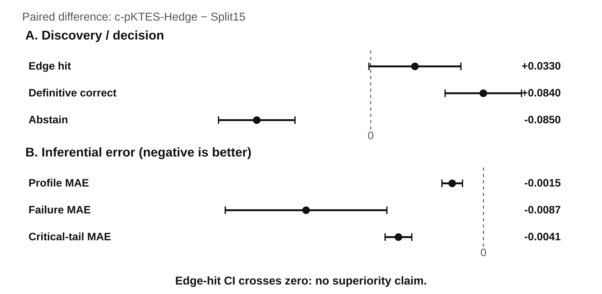
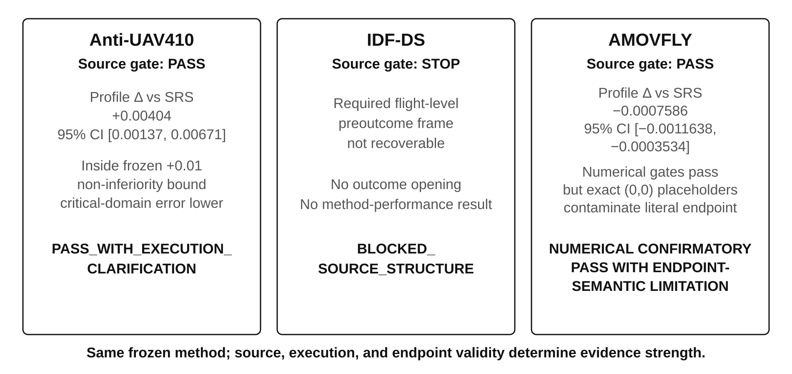

# Title Page — Journal of Quality Technology

**Article type:** Regular Research

## Manuscript title

**Probability-Preserving Active Test Allocation Balances Difficult-Case Discovery and Population Inference under Small Budgets**

## Authors

**AUTHOR INPUT NEEDED:** Insert the complete author list in final order.

## Affiliations

**AUTHOR INPUT NEEDED:** Insert all affiliations and map each author to affiliation(s).

## Corresponding author

**AUTHOR INPUT NEEDED:** Name, postal address, email, and telephone number if requested by the submission system.

## ORCID iDs

**AUTHOR INPUT NEEDED:** Insert ORCID iDs for authors who have them.

## Running title

Probability-Preserving Active Test Allocation

## Article statistics

- Main-text word-like count before References: approximately **6,600**
- Abstract: approximately **210 words**
- Main figures: **4**
- Main tables: **3**
- Supplementary Information: **10 sections / 4 supplementary tables** in the current supporting file

## Disclosure statement

**AUTHOR INPUT NEEDED:** Insert the authors' competing-interest statement. If none, use the journal-appropriate equivalent of “No potential competing interest was reported by the authors.”

## Funding

**AUTHOR INPUT NEEDED:** Insert all funding directly relevant to this work, including funder names and grant numbers. If none, state that no funding was received.

## Acknowledgments

**AUTHOR INPUT NEEDED:** Insert acknowledgments, or state none.

## Author contributions (CRediT)

**AUTHOR INPUT NEEDED:** Insert contributor roles after the final author list is fixed.

## Data and code availability

Public benchmark data are available from the sources cited in the manuscript. For double-anonymized review, code, realized sampling-design objects, and derived evaluation artifacts should be supplied through blinded supplementary review material. **AUTHOR ACTION NEEDED:** create the blinded review archive or upload the reproducibility bundle as anonymous supplementary files before final submission. The permanent public repository and archival identifier can be restored after review.

## Use of artificial intelligence tools

During manuscript preparation, the authors used ChatGPT (OpenAI, GPT-5.6 Sol, accessed October 2026) for language refinement, editorial restructuring of existing author-provided text, consistency checking, reference-style conversion, and coding assistance for manuscript-quality checks. The tool was not used to generate research data, replace the statistical analyses reported in the study, or determine the scientific conclusions. The authors reviewed and revised all AI-assisted outputs, verified numerical results and references against the underlying research record, checked the applicable terms of use, and take full responsibility for the originality, accuracy, and integrity of the manuscript.

---

## Abstract

Small physical-test budgets create a recurring design conflict in reliability and operational evaluation. Probability sampling supports inference over an operational population, whereas targeted testing is more likely to expose rare or difficult conditions. We develop **c-pKTES-Hedge**, a probability-preserving active allocation for a 40-test campaign. Three outcome-blind certainty sentinels are embedded within the probability design, and the remaining 37 selections retain known positive first-order inclusion probabilities while favoring kernel novelty and a prespecified compound adverse-tail score. Local Cube sampling provides spreading and auxiliary balance, and a stratum-wise Hájek model-assisted residual correction links the realized test sample back to the target population. In an independent confirmation over 1000 finite populations, c-pKTES-Hedge reduced profile, failure, and critical-tail mean absolute errors from 0.008348, 0.060399, and 0.020958 to 0.006824, 0.051746, and 0.016811, respectively, and increased definitive-correct decisions from 8.9% to 17.3%. Edge discovery was 81.2% versus 77.9% for a same-budget comparator with 15 deterministic difficult-case selections, with a paired confidence interval crossing zero. Three real-data applications then tested the conditions required for transport. Together, the results show that active difficult-case enrichment and finite-population inference can be combined within one small-budget design when preoutcome covariates, endpoint semantics, and realized inclusion probabilities remain valid.

**Keywords:** active sampling; balanced sampling; finite-population inference; Hájek estimator; operational test and evaluation; probability sampling; reliability evaluation; small-sample qualification; uncertainty quantification

---

## 1. Introduction

Physical testing of complex systems is often constrained by cost, safety, time, limited hardware, and the operational burden of reproducing rare conditions. These constraints are especially consequential in reliability demonstration, qualification, and operational test and evaluation (T&E), where the physical sample may be small even when the candidate operating space is large (National Research Council 1995; Willits, Dietz, and Moore 1997; Jeon and Ahn 2018). A campaign with only a few dozen trials is then expected to answer two distinct questions. First, what is the expected performance over the operational population? Second, does the system exhibit unacceptable behavior in rare, compound, or otherwise difficult conditions?

Those questions favor different allocation strategies. Equal-probability sampling provides a transparent basis for finite-population inference, but a small equal-probability sample can spend most of its budget in dense, routine regions. Deliberately selecting difficult cases addresses the opposite concern. Accelerated evaluation, importance sampling, and scenario-oriented test design therefore concentrate effort on rare or safety-relevant events when exhaustive testing is infeasible (Qian et al. 2026; Zhao et al. 2017; Kalra and Paddock 2016). Yet a deterministic difficult-case block does not, by itself, provide the same design-based link to the operational population. When deterministic discovery and probability audit are separated into two sub-campaigns, every trial assigned to one objective reduces the budget available to the other.

This tension is not unique to operational T&E. Survey sampling has long shown that unequal first-order inclusion probabilities can support valid inference when those probabilities are known (Deville and Tillé 2004; Kish 1965; Horvitz and Thompson 1952). Balanced and spatially balanced designs can also spread selections through auxiliary-feature space while honoring prescribed inclusion probabilities (Deville and Tillé 2004; Grafström, Lundström, and Schelin 2012). Model-assisted estimation provides a complementary idea: wall-to-wall auxiliary predictions may reduce residual variance while a probability sample supplies the correction needed for population inference (Särndal, Swensson, and Wretman 1992). Kernel methods and sample-selection correction offer tools for describing representational novelty and distributional discrepancy (Gretton et al. 2007; Huang et al. 2007). These components suggest that active enrichment need not be synonymous with nonprobability sampling.

The unresolved practical question is how to combine those ideas under a hard small-sample budget without losing either discovery pressure or inferential stability. Three design issues become coupled. First, deliberately chosen edge cases must enter the sampling design without turning a large share of the campaign into an inferentially disconnected deterministic block. Second, unequal probabilities must remain sufficiently positive and stable that inverse-probability weighting does not collapse the effective sample size. Third, auxiliary predictions and risk scores may guide allocation, but they should not be counted as if they were additional physical observations. Small-sample reliability decisions add a fourth issue: a design that produces narrow point estimates but unstable decision bounds may still be operationally unusable (Willits, Dietz, and Moore 1997; Jeon and Ahn 2018).

We address this problem with **c-pKTES-Hedge**, a probability-preserving active test-allocation architecture. At the frozen primary budget of 40 tests, three outcome-blind certainty sentinels receive inclusion probability one. The remaining 37 selections are drawn through an unequal-probability design with positive first-order inclusion probabilities, tilted toward kernel novelty and a prespecified compound adverse-tail score. Local Cube sampling spreads those selections in auxiliary-feature space. Population quantities are estimated using a stratum-wise Hájek model-assisted residual correction, and uncertainty is mapped to three legal decisions: Accept, Reject, or Inconclusive.

The design was not chosen in a single step. It emerged through an explicit R1–R5 development sequence. Early stages exposed the trade-off between population inference and edge discovery; later stages introduced certainty sentinels, diversified those sentinels to reduce dependence on the auxiliary risk model, and finally added a mild adverse-tail hedge to the probability remainder. The final constants, estimator, uncertainty construction, and 40-test architecture were then frozen before an independent confirmation over 1000 newly generated finite populations. This separation between development and confirmation is important because the central question is not whether a flexible search procedure can find a favorable allocation, but whether a fixed small-budget design retains its advantage on independent populations.

The paper makes three contributions. First, it formulates active difficult-case enrichment as part of a probability design rather than as a separate deterministic campaign. Certainty sentinels have legitimate first-order inclusion probability one, while the probability remainder preserves known positive inclusion probabilities for population inference. Second, it provides an independently confirmed small-budget comparison against a same-budget split deterministic/audit design, evaluating edge discovery, population estimation, decision performance, and uncertainty simultaneously. Third, it evaluates the method on independent real-data sources to identify the conditions under which the sampling-and-inference logic can be transported without outcome-driven redesign. The contribution is therefore a test-allocation and inference architecture, not a new general theorem for balanced or unequal-probability sampling.

---

## 2. Probability-Preserving Active Test Allocation

### 2.1 Finite-population objective

Let

\[
U=\{1,\ldots,N\}
\]

denote a finite population of candidate test conditions. Each condition carries an operational weight

\[
p_i\ge 0,\qquad \sum_{i\in U}p_i=1.
\]

The weights may be uniform when the finite population itself defines the target profile, or nonuniform when an external operational profile is available. Let \(Y_i\) denote a bounded performance outcome. When an engineering failure or adverse-event definition is semantically valid, let \(B_i\) denote the corresponding adverse indicator. Representative estimands are

\[
\theta_Y=\sum_i p_iY_i,
\qquad
\theta_B=\sum_i p_iB_i,
\]

with analogous means or rates defined within prespecified critical domains.

The primary live-test budget is fixed at

\[
n_L=40.
\]

At this scale, allocation cannot be treated as a minor design choice. If all 40 tests are selected to maximize difficult-case discovery, a population estimate requires assumptions that are not supplied by the selection design. If all 40 tests follow a diffuse equal-probability design, the sample may provide little direct evidence in rare regions. c-pKTES-Hedge therefore treats allocation as a joint optimization problem with three non-negotiable constraints: retain a probability basis for population inference, increase pressure toward informative or adverse regions, and keep the resulting weights stable enough for small-sample use.

A fourth constraint applies to confirmatory studies. Every quantity used to define strata, novelty, adverse-tail scores, certainty sentinels, or inclusion probabilities must be available before the live outcomes are opened. This separates design information from realized response information. In the external studies below, failure to construct such a preoutcome frame is treated as a source-eligibility problem rather than repaired with outcome-adjacent variables.

### 2.2 Why certainty sentinels are inside the probability design

The frozen design contains three **outcome-blind certainty sentinels** and a 37-unit probability remainder. A certainty unit is not an informal deterministic add-on. It is a legitimate component of a probability design with first-order inclusion probability

\[
\pi_i=1.
\]

This distinction is central. A conventional split design may reserve a large deterministic block for difficult conditions and use the remainder as a probability audit. Such a design can be effective for discovery, but the deterministic block and the audit block serve different inferential roles. c-pKTES-Hedge instead uses a small certainty portfolio to guarantee inclusion of selected high-value conditions while preserving a substantially larger probability component.

The three-sentinel portfolio contains one pure-novelty guard and two risk-aware sentinels. The pure-novelty sentinel protects against difficult conditions that are unusual in the available preoutcome feature space but may not be predicted as risky by the auxiliary model. The risk-aware sentinels use the same preoutcome information available to the sampling design to emphasize adverse-tail conditions. Sequential diversification prevents the certainty portfolio from collapsing into a single local neighborhood.

This mixed sentinel portfolio reflects the R3–R4 development evidence. Three risk-aware sentinels were effective in pooled settings but inherited the blind spots of the auxiliary risk model under hidden-bias conditions. Replacing one of them with a pure-novelty sentinel made the certainty component less dependent on a single definition of predicted risk. The final design therefore uses certainty selection sparingly: enough to create directed coverage, but not enough to dominate the inferential sample.

### 2.3 Active score and positive-probability remainder

For a non-certainty unit \(i\), let \(N_i\) denote kernel novelty and \(C_i\) a compound adverse-tail score, both computed from preoutcome information. The frozen active score is

\[
z_i=0.80N_i+0.20C_i.
\]

The 80% novelty component keeps the remainder sensitive to unusual operating conditions that are not necessarily captured by a risk predictor. The 20% adverse-tail component adds a mild directional hedge toward compound adverse configurations. Within stratum \(g\), first-order inclusion probabilities are tilted according to

\[
\pi_i\propto \exp\{3(z_i-\bar z_g)\},
\]

subject to exact stratum allocation and the frozen capped-inclusion implementation, which uses `min_probability_fraction=0.35`. The concentration parameter is therefore \(\lambda=3\), and the adverse-tail weight is \(\rho=0.20\).

These values are not tuned in the external studies. They are the terminal values of the R1–R5 development sequence and were frozen before independent confirmation. The probability floor is equally important. Active sampling is not useful for population inference if units outside the favored region receive vanishingly small probabilities and generate unstable inverse-probability weights. The floor limits that failure mode while preserving meaningful heterogeneity in the selection probabilities.

The result is an allocation that changes *how likely* each non-certainty condition is to be selected without converting the 37-unit remainder into convenience sampling. Known first-order inclusion probabilities remain available for design-aware estimation, uncertainty diagnostics, and effective-sample-size monitoring.

### 2.4 Local spreading and auxiliary balance

Unequal inclusion probabilities alone do not prevent redundant selections. Several high-scoring units may be very similar in the auxiliary feature space, especially when novelty and adverse-tail measures identify a common region. c-pKTES-Hedge therefore uses Local Cube sampling after the first-order probabilities have been prescribed (Deville and Tillé 2004; Grafström, Lundström, and Schelin 2012).

The role of Local Cube is operational rather than cosmetic. It discourages locally redundant samples and promotes spread or balance across auxiliary dimensions while preserving the prescribed probability structure. This is especially useful in a 40-test campaign, where spending several trials on near-duplicate conditions can materially reduce coverage of the candidate space.

The design therefore separates two functions. The active score determines *selection pressure* through \(\pi_i\). Local Cube determines *which joint sample realization* is chosen under those probabilities. Keeping those roles separate also improves interpretability: a reviewer can inspect the probability design independently from the spreading algorithm.

### 2.5 Model-assisted finite-population estimation

Let \(m_i\) be a wall-to-wall auxiliary prediction available for every population unit. Within stratum \(g\), c-pKTES-Hedge estimates the residual correction using a Hájek form,

\[
\widehat R_{g,H}
=
\frac{\sum_{i\in s_g}(p_{i\mid g}/\pi_i)(Y_i-m_i)}
{\sum_{i\in s_g}p_{i\mid g}/\pi_i},
\]

and combines the auxiliary population mean with the observed residual correction,

\[
\widehat\theta_Y
=
\sum_g P(G_g)
\left[
E_{p_g}\{m(X)\}+\widehat R_{g,H}
\right].
\]

This construction gives the auxiliary model a limited role. It can explain predictable structure in \(Y_i\), thereby reducing the residual variance that must be learned from the physical sample. It does not create synthetic live trials, and the residual correction remains anchored to the selected physical outcomes and their realized inclusion probabilities.

The Hájek ratio form is used for stability under unequal small-sample weights. We do not claim exact finite-sample unbiasedness of the ratio correction. Weight concentration is monitored separately with Kish effective sample size (ESS). In the external protocols, ESS thresholds are prespecified so that an apparently efficient point estimate cannot pass while relying on a numerically fragile probability component.

### 2.6 Uncertainty and three-state decisions

Point estimation is insufficient for qualification-style use. A small campaign may produce an estimate on the favorable side of a threshold while still carrying too much uncertainty for a defensible decision. c-pKTES-Hedge therefore couples the estimator to a frozen uncertainty construction and a three-state decision rule.

The uncertainty diagnostic is

\[
\widehat V=\max(\widehat V_{GS},\widehat V_{PWR}),
\]

with the R3 calibration reused unchanged in R5 and Phase 2. The frozen absolute failure calibration is 0.137719714266479 and the safety-facing upper calibration is 0.19767009190382911. These are empirical calibration constants within the development/confirmation architecture; they are not asserted to be distribution-free under arbitrary domain shift.

The legal outputs are **Accept**, **Reject**, and **Inconclusive**. The third state is intentional. Under a hard 40-test budget, forcing every campaign to produce a binary qualification call would reward overconfident uncertainty estimates. The method instead treats abstention as a valid result when the available physical evidence does not support a sufficiently strong decision.

### 2.7 Practical implementation contract

For application, the method can be implemented as a six-stage contract.

1. **Define the finite population and target weights.** Candidate test units, operational weights, strata, critical domains, and decision endpoints are fixed before sampling.
2. **Freeze preoutcome auxiliary information.** Novelty features, adverse-tail variables, and any wall-to-wall predictor are constructed without live outcomes.
3. **Construct the realized design object.** Certainty sentinels, first-order inclusion probabilities, stratum allocations, and seeds are written and hashed before outcomes are opened.
4. **Draw the probability remainder.** Local Cube is applied under the prescribed \(\pi_i\) and fixed stratum allocations.
5. **Estimate with the realized probabilities.** Population and critical-domain quantities are computed using the exact realized design object rather than regenerated approximations.
6. **Apply uncertainty and decision rules.** ESS, uncertainty, and Accept/Reject/Inconclusive logic are evaluated using the frozen thresholds.

This contract is summarized in Table 1 and Figure 1.

**Table 1. Frozen c-pKTES-Hedge contract.**

| Component | Frozen specification |
|---|---|
| Budget / architecture | `n=40`: 3 outcome-blind certainty sentinels + 37 positive-`pi` remainder units |
| Sentinel portfolio | 1 pure-novelty + 2 risk-aware certainty units with sequential diversification |
| Active score | 80% kernel novelty + 20% compound adverse-tail; `rho=0.20`, `lambda=3`, `min_probability_fraction=0.35` |
| Selection | Local Cube under fixed stratum allocation |
| Estimation | stratum-wise Hájek model-assisted residual correction |
| UQ / decision | `max(GS,PWR)`, frozen R3 calibration; Accept / Reject / Inconclusive |
| Reproducibility identity | source/runtime metadata + hashed realized design object |

**Figure 1.** c-pKTES-Hedge embeds three outcome-blind certainty sentinels in a 40-test probability design; the other 37 tests retain known positive first-order inclusion probabilities. The active score changes the probability design, while Local Cube controls sample spreading under those probabilities.

---

## 3. Development and Evaluation Design

### 3.1 R1–R5 development sequence

The final architecture was reached through five explicit development stages rather than selected directly from the confirmation results.

**R1** established the basic trade-off. An all-probability design was compared with a split design containing 15 deterministic difficult-case selections and a smaller probability audit. The all-probability design improved profile and critical-tail inference but sacrificed edge discovery. This result showed that probability preservation alone was not sufficient.

**R2** introduced novelty-driven unequal inclusion probabilities and local spreading. The change increased edge discovery by moving probability mass toward unusual conditions while retaining positive probabilities across the remainder. Some discrepancy regimes still favored the deterministic split design on edge discovery, indicating that unequal probabilities alone did not provide a sufficiently strong discovery guarantee.

**R3** introduced three risk-aware certainty sentinels. Pooled edge discovery reached the split baseline, while the probability remainder continued to support population inference. Hidden-bias conditions then exposed a structural weakness: all three sentinels inherited the same auxiliary risk model and could collectively miss conditions that were novel but not predicted as risky.

**R4** diversified the certainty portfolio to one pure-novelty sentinel and two risk-aware sentinels. The change was designed to retain directed adverse-case pressure while reducing common-mode dependence on the auxiliary risk model.

**R5** added a mild compound adverse-tail component to the probability remainder itself. The final score used 80% kernel novelty and 20% adverse-tail information, and \(\rho=0.20\) was frozen before confirmation. This final step distributed part of the adverse-case pressure across the inferential sample instead of relying entirely on three certainty selections.

The final Phase 2 method is therefore the terminal architecture of this development sequence. No external dataset was used to continue the R1–R5 search.

### 3.2 Independent controlled confirmation

After R5 was frozen, the final design was evaluated on **1000 new finite populations**, with 200 populations generated under each of five prespecified discrepancy regimes: `good`, `global_bias`, `tail_bias`, `hidden_bias`, and `mixed`. The confirmation populations and seeds were independent of the R1–R5 development search.

The principal comparator, **Split15**, used the same total budget \(n=40\). Fifteen tests were reserved for deterministic geometry/difficulty selection and the remaining 25 formed a probability audit. This comparator represents the explicit split between difficult-case discovery and population audit used throughout development. Same-budget comparison is important because the central claim concerns allocation of a scarce physical-test resource rather than asymptotic statistical efficiency.

The primary metrics were selected to reflect both objectives of the design. **Profile MAE** measures error in the operational-profile mean. **Failure MAE** measures error in the relevant adverse-event rate when that endpoint is defined. **Critical-tail MAE** measures error in critical regions. **Edge hit** records whether the selected sample includes difficult-edge conditions. **Definitive-correct** records a correct non-inconclusive decision, while **abstention** records an Inconclusive output. Coverage and false acceptance were evaluated separately to ensure that a higher definitive-decision rate was not obtained by relaxing uncertainty control.

The R3 uncertainty calibration was frozen before these confirmation populations were generated. Confirmation therefore evaluates the complete method, including allocation, estimation, uncertainty, and decision logic, rather than retuning a downstream interval after seeing the R5 outcomes.

### 3.3 External real-data evaluation as a transport test

The external studies were designed to ask a different question from the controlled confirmation. They do not search for another setting in which c-pKTES-Hedge wins a benchmark. They test whether the **sampling-and-inference contract** can be instantiated when the population, preoutcome covariates, endpoint semantics, and data-generating process are no longer under simulator control.

Three rules govern this stage. First, the method constants are unchanged. Second, a source must provide unit-linked information sufficient to construct the prespecified preoutcome design frame before outcomes are opened. Third, if an endpoint-semantic problem is discovered after execution, the executed result remains part of the record and its interpretation is narrowed rather than replaced by a post-outcome redefinition.

This design turns external evaluation into a sequence of applicability conditions: source admissibility, design construction, numerical comparison, endpoint interpretation, and realized-design identity. The numerical method comparison is meaningful only after the earlier conditions have been satisfied.

### 3.4 Anti-UAV410

Phase 2A used the official Anti-UAV410 120-sequence test split and the frozen SiamFC system under test (Huang et al. 2024). The primary response was per-sequence State Accuracy. Outcome-blind covariates included six challenge indicators, four target-size indicators, and log sequence length. The four size strata contained 33 Tiny, 54 Small, 29 Medium, and 4 Normal sequences, with a frozen \(n=40\) allocation of 11/17/10/2.

The protocol used 500 paired design replays. c-pKTES-Hedge was compared with stratified simple random sampling (SRS) and the split-style comparator. Prespecified checks included positive-inclusion support, probability-component ESS, a +0.01 non-inferiority margin for profile error relative to stratified SRS, critical-domain error, and difficult-case hit. These checks evaluate both the inferential price of active sampling and whether the active design actually reaches difficult sequences.

### 3.5 IDF-DS and AMOVFLY

IDF-DS was selected as an engineering-facing source containing 240 real fixed-wing UAS flights (Garcia-Gascon et al. 2026; Garcia-Gascon 2025). The preregistered Phase 2B design required per-flight mission, configuration, and environmental covariates available before telemetry outcomes. The source audit was therefore performed before outcome evaluation.

AMOVFLY provided a separate flight-level population in which the preoutcome frame could be frozen (YujiaoHu 2026). The confirmatory population contained **257 unique autonomous ready-data flights** across four scenario strata: FAFS 33, FAVS 165, VAFS 32, and VAVS 27. The \(n=40\) allocation was 6/23/6/5. The literal primary performance endpoint was the proportion of waypoint episodes attaining an external 10 m reference radius. As in the controlled study, the design object was frozen before outcomes were used for method comparison.

Detailed development tables, uncertainty diagnostics, exact external comparator implementations, replay artifacts, and audit files are retained in the Supplementary Information.

---

## 4. Results

### 4.1 Independent confirmation improves population inference

Across 1000 independent finite populations, c-pKTES-Hedge reduced all three primary inference errors relative to Split15 (Table 2; Figure 2). Profile MAE decreased from 0.008348 to 0.006824, an 18.3% reduction. Failure MAE decreased from 0.060399 to 0.051746, a 14.3% reduction. Critical-tail MAE decreased from 0.020958 to 0.016811, a 19.8% reduction. The paired 95% confidence intervals for all three differences excluded zero.

The improvement is notable because c-pKTES-Hedge did not use more physical tests. Both designs used \(n=40\). The difference was how the budget was partitioned: three certainty sentinels plus a 37-unit probability remainder versus a 15-unit deterministic block plus 25-unit audit. The result therefore supports the central design hypothesis that much of the difficult-case pressure can be expressed inside a probability-preserving architecture without surrendering the population-inference contribution of a large share of the campaign.

Definitive-correct decisions increased from 8.9% to 17.3%, a paired difference of 8.4 percentage points (95% CI 5.55 to 11.25 percentage points). Abstention decreased from 91.1% to 82.6%. These changes did not arise from simply weakening the uncertainty layer. The R3 calibration raised failure marginal coverage from 94.9% to 99.0% and safety upper-bound coverage from 97.1% to 99.9% in the frozen confirmation. The main effect of the final design was therefore to improve the efficiency of the observed physical evidence while retaining a conservative decision framework.

**Figure 2.** Paired c-pKTES-Hedge-minus-Split15 differences in the independent 1000-population confirmation. Negative values favor c-pKTES-Hedge for error metrics; the edge-hit interval crosses zero.

**Table 2. R5 independent confirmation, `n=40`.**

| Metric | c-pKTES-Hedge | Split15 | Paired difference | 95% CI |
|---|---:|---:|---:|---:|
| Edge hit | **0.812** | 0.779 | +0.033 | -0.0013 to +0.0673 |
| Profile MAE | **0.006824** | 0.008348 | -0.001525 | -0.002025 to -0.001024 |
| Failure MAE | **0.051746** | 0.060399 | -0.008653 | -0.012595 to -0.004711 |
| Critical-tail MAE | **0.016811** | 0.020958 | -0.004147 | -0.004798 to -0.003497 |
| Definitive correct | **0.173** | 0.089 | +0.084 | +0.0555 to +0.1125 |
| Abstain | 0.826 | 0.911 | -0.085 | -0.1135 to -0.0565 |

### 4.2 Difficult-case discovery remains comparable at the supported precision

Edge discovery was 81.2% for c-pKTES-Hedge and 77.9% for Split15. The paired difference was +3.3 percentage points, with 95% CI -0.13 to +6.73 percentage points. Because the interval crosses zero, the result does not establish edge-discovery superiority. It does, however, show that the substantial reduction in the deterministic block from 15 tests to three certainty sentinels did not produce a detected aggregate edge-discovery penalty at the precision of this confirmation.

The hidden-bias subgroup provides the most informative boundary. In that regime, edge hit was 77.0% for c-pKTES-Hedge and 79.5% for Split15, a difference of -2.5 percentage points with 95% CI -10.17 to +5.17 percentage points. This is consistent with the design logic that motivated the pure-novelty sentinel: auxiliary-risk information cannot directly target a condition it does not represent. The final architecture reduces that common-mode dependence, but it cannot guarantee dominance over a much larger deterministic difficult-case block in every hidden-bias setting.

Across 945 true-Reject populations, zero false accepts were observed. This finite confirmation result is encouraging but is not interpreted as a zero operational false-accept probability. The controlled evidence instead supports a narrower conclusion: within the frozen simulation family, c-pKTES-Hedge improved inference and definitive-decision efficiency while preserving edge discovery at a level statistically compatible with Split15.

### 4.3 Anti-UAV410 shows the intended inference–discovery trade-off on real data

Anti-UAV410 provided the first independent real-data test of the frozen architecture. Across 500 paired replays, c-pKTES-Hedge achieved mean profile error 0.03007, critical-domain error 0.04893, and difficult-case hit 1.000. Stratified SRS achieved profile error 0.02603, critical-domain error 0.05911, and difficult-case hit 0.996.

The active design therefore did not dominate every metric. Its profile error exceeded SRS by 0.00404 (95% CI 0.00137 to 0.00671), but the entire interval remained inside the prespecified +0.01 non-inferiority margin. At the same time, critical-domain error was lower by 0.01018 (95% CI -0.01230 to -0.00806). The result is consistent with the intended trade-off: active pressure spends some inferential efficiency to improve representation of difficult domains, but the observed profile cost remained within the frozen tolerance.

Weight stability was strong. The probability-remainder ESS had median 33.12 and fifth percentile 32.60, well above the frozen thresholds of 18.5 and 12. No non-certainty inclusion-probability failure occurred. These results matter because they show that the observed critical-domain improvement was not obtained by concentrating nearly all inferential weight on a small number of selected sequences.

The exact 15+25 Split15 adaptation and finite-domain critical-domain estimator required clarification after recovery of the primary sequence outcomes. The external result is therefore retained with an execution clarification rather than treated as a pristine preregistered confirmation. The directly frozen c-pKTES/SRS components nevertheless provide a clean test of positive-inclusion support, weight stability, and profile non-inferiority.

### 4.4 IDF-DS stops at the source-design interface

IDF-DS did not produce a c-pKTES-Hedge performance result. The public release contained flight telemetry and archive-level mission information, but it did not provide the unit-linked per-flight mission/configuration structure required by the preregistered preoutcome design at the necessary resolution. The SpeedyBee processed release also exposed 111 lap identifiers rather than the intended 120 flight units.

Realized GPS paths, speed, altitude, wind histories, flight duration, flight modes, failsafe states, actuator traces, power, airspeed, and post-flight quality variables could have been used to construct an informative design frame. Doing so, however, would have replaced preoutcome design information with realized telemetry. The study therefore stopped before opening telemetry outcomes for method comparison.

This result is relevant to implementation even though it is not a performance comparison. An active probability design is only as confirmatory as the information used to construct it. If the design frame can be created only after observing variables that are themselves consequences of the realized flight, the sampling study has moved from external validation back into method development.

### 4.5 AMOVFLY supplies numerical confirmation and reveals an endpoint constraint

AMOVFLY provided a second numerical external comparison on the frozen 257-flight population. c-pKTES-Hedge achieved profile error 0.003784, critical-domain error 0.033764, difficult-case hit 1.000, and probability-component ESS median 35.224. Stratified SRS achieved profile error 0.004543 and critical-domain error 0.066201. The paired profile-error difference favored c-pKTES-Hedge by -0.0007586 (95% CI -0.0011638 to -0.0003534), and all frozen numerical comparison gates passed.

A post-execution semantic audit then identified a problem with the literal waypoint endpoint. All 257 flights contained at least one exact \((0,0)\) `aim_lat/aim_long` episode. There were 378 exact-zero episodes in total, and exactly the same 378 episodes had minimum actual-to-aim distance above 100 km. No non-zero target generated such an episode. Under the literal parser, the flight-level failure indicator was therefore one for every flight.

This finding changes the engineering interpretation of the endpoint but not the recorded sampling comparison. The confirmatory numerical result is retained, while clean failure-rate qualification is not claimed for the literal endpoint. A separately labelled post-outcome sensitivity that excludes exact-zero episodes preserves the method-comparison ranking, but because that exclusion rule was identified after outcome inspection, it is not promoted to a replacement confirmation. The main value of the AMOVFLY study is thus twofold: it supplies a favorable numerical comparison for the frozen design and demonstrates why endpoint semantics must be validated independently of numerical estimator performance.

**Figure 3.** The external applications exercise different parts of the transport contract. Anti-UAV410 reaches numerical comparison with an execution clarification, IDF-DS stops at source admissibility before outcome opening, and AMOVFLY reaches numerical confirmation but reveals an endpoint-semantic constraint.

**Table 3. External evidence classification.**

| Dataset | Primary external result | Interpretation-changing issue | Evidence class |
|---|---|---|---|
| Anti-UAV410 | profile difference `+0.00404` vs SRS, 95% CI `0.00137` to `0.00671`, within frozen `+0.01` bound; critical-domain error lower | comparator and finite-domain estimator required execution clarification | `PASS_WITH_EXECUTION_CLARIFICATION` |
| IDF-DS | source stopped before outcome opening; no method-performance result | preregistered flight-level preoutcome frame not recoverable from public release | `BLOCKED_SOURCE_STRUCTURE` |
| AMOVFLY | profile difference `-0.0007586` vs SRS, 95% CI `-0.0011638` to `-0.0003534`; all frozen numerical gates pass | exact `(0,0)` waypoint placeholders contaminate the literal endpoint | `NUMERICAL CONFIRMATORY PASS WITH ENDPOINT-SEMANTIC LIMITATION` |

### 4.6 The realized inclusion-probability vector is part of the statistical design

A later hosted-runner attempt to regenerate the AMOVFLY design reproduced the declared source/runtime metadata, standardization statistics, kernel bandwidth, seed lineage, and certainty-sentinel identities. Nevertheless, 254 of 257 first-order inclusion probabilities differed by more than \(10^{-12}\), with maximum absolute difference 0.0108412. An example Local-Cube selected set also changed.

No tolerance was relaxed to force equivalence. Because the estimator and ESS diagnostics depend directly on \(\pi_i\), the post-outcome sensitivity analysis loads the immutable realized design object from the successful confirmatory run rather than regenerating it. For this class of floating-point unequal-probability design, the realized inclusion-probability vector is therefore part of the statistical research object.

This observation strengthens the practical implementation contract in Section 2.7. Reproducibility requires more than preserving source code and a random seed when downstream inference depends on the exact realized probabilities. The design object should be written, hashed, and archived before outcomes are opened.

---

## 5. Discussion

### 5.1 One campaign can serve discovery and inference without splitting the budget in half

The central contribution of c-pKTES-Hedge is architectural. Difficult-case discovery and population inference are often treated as competing campaigns: a targeted test set for finding failures and a probability audit for estimating aggregate behavior. Under a severe physical-test budget, that split is expensive because the targeted block contributes little to the inferential sample and the audit block contributes little directed discovery pressure.

c-pKTES-Hedge replaces the large deterministic block with a small certainty portfolio embedded in the probability design. Three sentinels guarantee direct attention to selected difficult regions, while 37 probability-remainder tests retain known positive inclusion probabilities. The R5 confirmation shows why that allocation matters. Compared with a 15+25 split at the same total budget, the final design lowers profile, failure, and critical-tail error and increases definitive-correct decisions, while aggregate edge discovery remains statistically compatible with the split comparator.

This result does not imply that deterministic edge selection is unnecessary. The hidden-bias subgroup shows that a large deterministic difficult-case block can retain local advantages when the auxiliary information fails to identify the relevant region. The result instead changes the default trade-off: a campaign does not need to surrender 15 of 40 trials to a noninferential difficult-case block to maintain competitive discovery pressure.

### 5.2 The value comes from division of roles, not from a single new component

The method builds on established ideas in unequal-probability sampling, the cube method, spatially balanced selection, model-assisted estimation, and kernel-based representation analysis (Deville and Tillé 2004; Grafström, Lundström, and Schelin 2012; Kish 1965; Särndal, Swensson, and Wretman 1992; Horvitz and Thompson 1952; Gretton et al. 2007; Huang et al. 2007). Its methodological contribution is how these components are assigned distinct roles under a hard test-count constraint.

The certainty sentinels provide guaranteed directed coverage. The novelty term protects against unrepresented regions. The mild adverse-tail term provides risk-aware pressure without allowing the risk model to control the entire sample. The probability floor constrains weight instability. Local Cube reduces redundant local selections. The model-assisted estimator uses predictions to explain population structure without treating them as additional physical trials. Finally, the three-state decision layer allows the campaign to remain inconclusive rather than convert small-sample uncertainty into a forced binary decision.

The R1–R5 sequence is important because it shows that these roles were not interchangeable. R1 demonstrated that pure probability preservation could sacrifice discovery. R3 demonstrated that risk-aware certainty alone could inherit model blind spots. R4 introduced a novelty hedge at the certainty layer, and R5 added a second mild hedge across the probability remainder. The final architecture is therefore better understood as a coordinated design than as a single scoring function.

### 5.3 Implications for quality and reliability test planning

For quality and reliability applications, the method is most relevant when four conditions coexist: the physical test budget is small, a finite or enumerable candidate population exists, useful auxiliary covariates are available before testing, and decisions require both aggregate inference and attention to adverse regions.

The method does not require the auxiliary predictor to be trusted as a substitute for physical evidence. This is practically important. Simulation, surrogate models, historical data, or engineering heuristics can guide novelty scores, risk scores, strata, or residual prediction. Their role remains auxiliary. Population correction still comes from the probability-selected physical outcomes and the exact realized inclusion probabilities.

The three-state decision rule is also operationally important. In reliability work, it is tempting to treat a higher rate of definitive decisions as automatically better. That is not the objective here. A definitive decision is useful only when uncertainty remains controlled. The R5 result is stronger because the higher definitive-correct rate appears together with conservative calibrated coverage, not because the method simply abstains less.

The external studies add a second planning lesson: the data source must be selected with the sampling design in mind. IDF-DS contained rich telemetry but still failed the preoutcome design requirement. A dataset can therefore be information-rich yet unsuitable for confirmatory test allocation if the necessary covariates are available only after the test unfolds. For prospective use, preoutcome mission, configuration, environment, and operational-profile information should be treated as part of the experimental design specification.

### 5.4 External transport depends on more than numerical performance

The real-data applications show why external validation of a test-allocation method cannot be reduced to a single accuracy table. Anti-UAV410 supplies an interpretable allocation trade-off: profile error increases modestly relative to SRS while critical-domain error improves, and the profile cost remains within a prespecified tolerance. This is the type of result expected from an active design whose purpose is not uniform dominance across every summary metric.

AMOVFLY demonstrates a different constraint. Its numerical comparison is favorable, but the literal waypoint endpoint is contaminated by systematic placeholder semantics. No amount of numerical superiority in the sampling estimator can make a semantically invalid engineering endpoint suitable for qualification. Endpoint validation is therefore logically prior to interpreting a sampling result as engineering evidence.

The IDF-DS source stop and the AMOVFLY endpoint audit are not competing negative findings. They identify different interfaces in the same methodology. Source admissibility concerns whether the design can be frozen before outcome access. Endpoint semantics concern whether the measured response means what the qualification claim requires. Both conditions must hold before numerical performance can support an external confirmatory interpretation.

### 5.5 Realized-design provenance should be treated as part of reproducibility

The AMOVFLY regeneration audit exposes a less obvious issue. For ordinary simulation studies, source code, package versions, and random seeds are often treated as a sufficient computational identity. That assumption is weaker for unequal-probability designs when floating-point computations feed directly into first-order probabilities and the final sample realization.

Here, high-level environment and seed information were reproduced while the \(\pi_i\) vector changed. Because the estimator, ESS, and subsequent sensitivity analyses depend on those probabilities, numerical closeness is not equivalent to design identity. The practical remedy is simple: write the realized design object before outcome access, hash it, and use that object directly for downstream inference.

This requirement also improves auditability. It separates questions about the *design that was actually executed* from questions about whether a later software environment can recreate it. For confirmatory small-sample studies, that distinction is worth preserving even when the numerical drift appears modest.

### 5.6 Boundaries and next test

The strongest evidence in this study is the independent controlled confirmation. It remains simulation-based despite its 1000 independent finite populations and five discrepancy regimes. The edge-hit interval does not establish superiority over Split15, and hidden-bias conditions remain an informative boundary.

The external studies extend the evidence but do not constitute operational weapon-system certification. Anti-UAV410 is a task-effectiveness benchmark with an execution clarification. IDF-DS does not reach a performance comparison. AMOVFLY supplies numerical confirmation but not a clean literal failure-rate endpoint. The empirical R3 uncertainty calibration has been tested within the development/confirmation architecture and should not be interpreted as distribution-free under arbitrary domain shift.

The next decisive study is therefore not another retrospective search for a favorable dataset. It is a new engineering population designed prospectively around the method contract: unit-linked preoutcome mission/configuration/environment covariates, independently verified endpoint semantics, a frozen target population and critical domains, and a hashed realized c-pKTES-Hedge design object before outcome opening. Such a study would directly test whether the controlled inference–discovery advantage persists when the full design and endpoint contract are satisfied in an independent engineering setting.

**Figure 4.** External evidence for a small-budget test-allocation method depends on a sequence of conditions: an admissible preoutcome source frame, a frozen design, valid endpoint semantics, exact realized-design provenance, and the numerical comparison itself.

---

## 6. Conclusion

c-pKTES-Hedge addresses a recurring small-budget quality and reliability problem: population inference favors probability sampling, whereas difficult-case discovery favors directed selection. The method places three outcome-blind certainty sentinels inside a 40-test probability design and retains known positive first-order inclusion probabilities for the remaining 37 tests.

In 1000 independent finite populations, this allocation lowered profile, failure, and critical-tail error and increased definitive-correct decisions relative to a same-budget comparator that reserved 15 tests for deterministic difficult cases. Edge discovery remained statistically compatible with that comparator at the precision of the paired confirmation. Real-data applications further showed that numerical performance is interpretable only when the preoutcome frame, endpoint meaning, and realized inclusion-probability design remain valid.

The resulting contribution is a probability-preserving way to allocate scarce physical tests toward difficult conditions without abandoning finite-population inference. For small-budget reliability and operational evaluation, the central design choice is therefore not simply probability sampling versus active targeting, but how to express active targeting inside a probability design whose inferential and computational identity can be preserved.

---

---

## Data and Code Availability

The public benchmark data used in the external studies are available from the sources cited in the manuscript. During double-anonymized review, the analysis code, realized sampling-design objects, and derived evaluation artifacts required to reproduce the reported results are available to editors and reviewers through blinded supplementary review material. The permanent public repository and archival identifier will be disclosed after the double-anonymized review process.

## Use of Artificial Intelligence Tools

During manuscript preparation, the authors used ChatGPT (OpenAI, GPT-5.6 Sol, accessed October 2026) for language refinement, editorial restructuring of existing author-provided text, consistency checking, reference-style conversion, and coding assistance for manuscript-quality checks. The tool was not used to generate research data, replace the statistical analyses reported in the study, or determine the scientific conclusions. The authors reviewed and revised all AI-assisted outputs, verified numerical results and references against the underlying research record, checked the applicable terms of use, and take full responsibility for the originality, accuracy, and integrity of the manuscript.

---

## References

Deville, J.-C., and Y. Tillé. 2004. “Efficient balanced sampling: The cube method.” *Biometrika* 91 (4): 893–912. https://doi.org/10.1093/biomet/91.4.893.

Garcia-Gascon, C. 2025. “Fixed-Wing UAS Telemetry Benchmark (IDF_DS): 240 Flights for ML and Intelligent Trajectory Optimization.” Zenodo. https://doi.org/10.5281/zenodo.16992975.

Garcia-Gascon, C., J. Bas-Bolufer, P. Castello-Pedrero, and J. A. Garcia-Manrique. 2026. “An open benchmark dataset for machine learning and intelligent trajectory optimization in fixed-wing unmanned aerial systems.” *Scientific Data* 13: 364. https://doi.org/10.1038/s41597-026-06716-3.

Grafström, A., N. L. P. Lundström, and L. Schelin. 2012. “Spatially balanced sampling through the pivotal method.” *Biometrics* 68 (2): 514–520. https://doi.org/10.1111/j.1541-0420.2011.01699.x.

Gretton, A., K. M. Borgwardt, M. Rasch, B. Schölkopf, and A. J. Smola. 2007. “A kernel method for the two-sample-problem.” In *Advances in Neural Information Processing Systems 19*, 513–520. https://doi.org/10.7551/mitpress/7503.003.0069.

Horvitz, D. G., and D. J. Thompson. 1952. “A generalization of sampling without replacement from a finite universe.” *Journal of the American Statistical Association* 47 (260): 663–685.

Huang, B., J. Li, J. Chen, G. Wang, J. Zhao, and T. Xu. 2024. “Anti-UAV410: A thermal infrared benchmark and customized scheme for tracking drones in the wild.” *IEEE Transactions on Pattern Analysis and Machine Intelligence* 46 (5): 2852–2865. https://doi.org/10.1109/TPAMI.2023.3335338.

Huang, J., A. J. Smola, A. Gretton, K. M. Borgwardt, and B. Schölkopf. 2007. “Correcting sample selection bias by unlabeled data.” In *Advances in Neural Information Processing Systems 19*, 601–608. https://doi.org/10.7551/mitpress/7503.003.0080.

Jeon, J., and S. Ahn. 2018. “Bayesian methods for reliability demonstration test for finite population using lot and sequential sampling.” *Sustainability* 10 (10): 3671. https://doi.org/10.3390/su10103671.

Kalra, N., and S. M. Paddock. 2016. “Driving to safety: How many miles of driving would it take to demonstrate autonomous vehicle reliability?” *Transportation Research Part A: Policy and Practice* 94: 182–193.

Kish, L. 1965. *Survey Sampling*. New York: Wiley.

National Research Council. 1995. *Statistical Methods for Testing and Evaluating Defense Systems: Interim Report*. Washington, DC: National Academies Press.

Qian, C., J. Xu, X. Xing, and F. Guo. 2026. “Test case sampling optimization for safety validation of automated driving systems.” *Nature Communications* 17: 3114. https://doi.org/10.1038/s41467-026-69675-8.

Särndal, C.-E., B. Swensson, and J. Wretman. 1992. *Model Assisted Survey Sampling*. New York: Springer.

Willits, C. J., D. C. Dietz, and A. H. Moore. 1997. “Series-system reliability estimation using very small binomial samples.” *IEEE Transactions on Reliability* 46 (2): 296–302. https://doi.org/10.1109/24.589960.

YujiaoHu. 2026. “AMOVFLY-Dataset: Dataset associated with ‘AMOVFLY: Enabling Advanced UAV Modeling with the Comprehensive Flight Status Dataset’.” GitHub repository, source snapshot used in this study accessed October 2026.

Zhao, D., H. Lam, H. Peng, S. Bao, D. J. LeBlanc, K. Nobukawa, and C. S. Pan. 2017. “Accelerated evaluation of automated vehicles safety in lane-change scenarios based on importance sampling techniques.” *IEEE Transactions on Intelligent Transportation Systems* 18 (3): 595–607. https://doi.org/10.1109/TITS.2016.2582208.